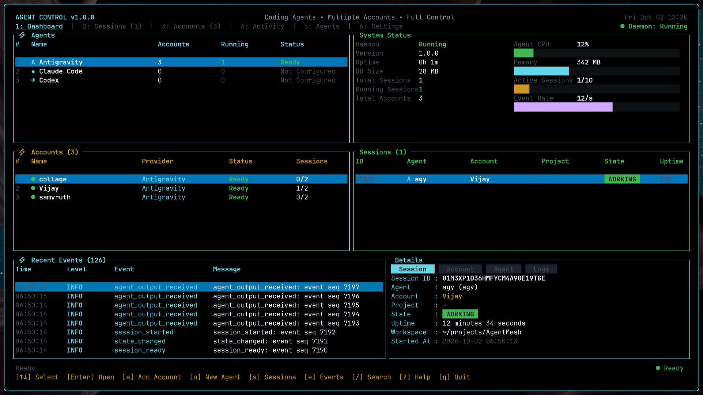
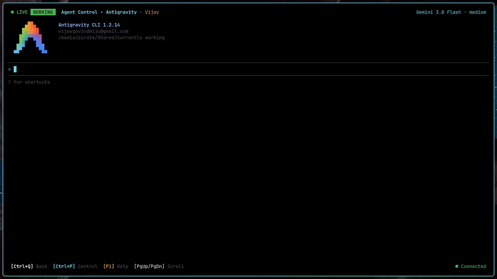
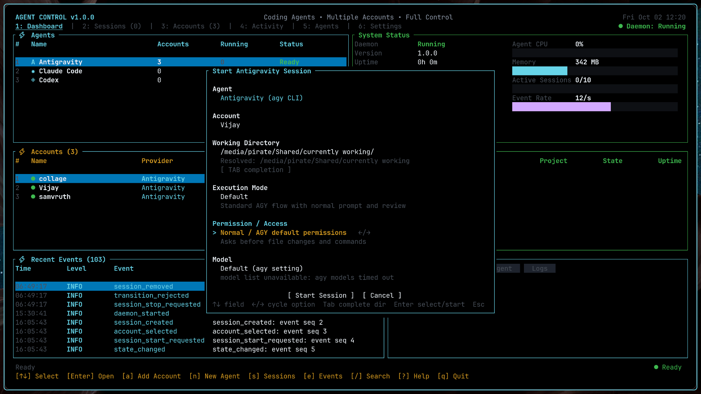
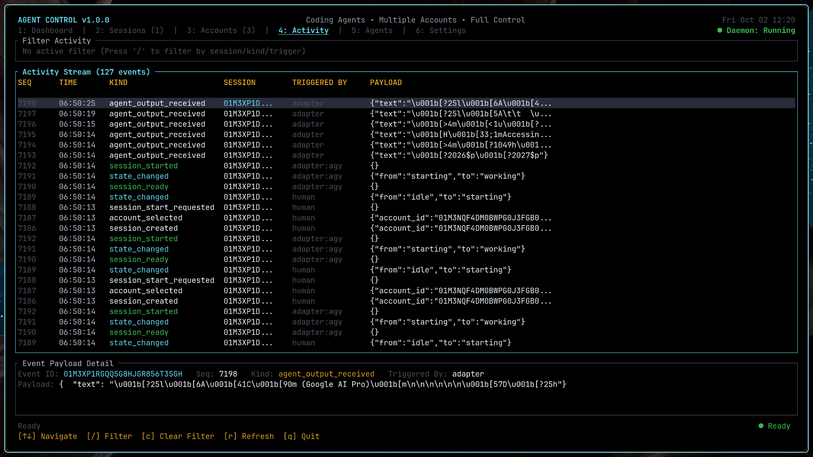

# AgentControll

A local-first control plane for coding agents.

> **Status:** Version 1.0.7 released. Fully verified with zero compiler warnings and 100% test pass rate across all workspace test suites.

---

## Screenshots

### Supervisor Dashboard
The main control plane dashboard displaying active agent sessions, multi-account pools, system telemetry (CPU, memory, event rate), and live event streams.



### Full-Screen Virtual ANSI Terminal
Interactive agent execution inside a dedicated virtual terminal buffer (`crates/ac-tui/src/terminal_buffer.rs`) with truecolor rendering, alternate screen support, and instant detach hotkeys (`Ctrl+Q` or `Ctrl+]`).



### Interactive Session Launcher
Launch coding agents with shell-style `Tab` directory completion, account binding, execution mode selection, and safety boundaries.



### Real-Time Activity Stream & Audit Trail
Structured event stream logging every state transition, tool execution, and approval payload for complete operational visibility.



---

## Table of Contents

1. [Screenshots](#screenshots)
2. [What is AgentControll?](#what-is-agentcontroll)
3. [What Problem It Solves](#what-problem-it-solves)
4. [Features](#features)
5. [Installation](#installation)
6. [Platform Support](#platform-support)
7. [Supported Agents](#supported-agents)
8. [Architecture Overview](#architecture-overview)
9. [Quick Start & Usage](#quick-start--usage)
10. [Configuration](#configuration)
11. [Accounts & Authentication](#accounts--authentication)
12. [Working Directories & Projects](#working-directories--projects)
13. [Execution Modes](#execution-modes)
14. [Permission & Access Controls](#permission--access-controls)
15. [TUI Controls](#tui-controls)
16. [Security](#security)
17. [Troubleshooting](#troubleshooting)
18. [Development](#development)
19. [Testing](#testing)
20. [Roadmap](#roadmap)
21. [Contributing](#contributing)
22. [License](#license)

---

## What is AgentControll?

**AgentControll** is a local supervisor daemon, interactive terminal interface, and automation CLI that manages the complete lifecycle of coding agents—such as **Google Antigravity (`agy`)**, **Claude Code**, **Codex**, and **Devin CLI**.

It coordinates multiple agent processes across different repositories and accounts, supervises interactive PTY streams, isolates credentials per profile, automates permissions, and maintains an append-only event log persisted in SQLite.

Antigravity support is managed through the AgentControll TUI. AgentControll
does not install or provide an `agy` command; any `agy` executable on your
PATH remains the separate Antigravity CLI installed on your system.

---

## What Problem It Solves

Developers running coding agents across various projects, teams, and accounts encounter significant friction:
- **Terminal Fragmentation:** Running multiple agents in disconnected terminal tabs leads to lost context, untracked tool invocations, and unmonitored processes.
- **Credential Collisions:** Managing multiple provider accounts (e.g., personal vs. work Google/Gemini accounts) in a shared home directory causes token overwrites and accidental cross-billing.
- **Quota Exhaustion:** When an agent encounters provider rate limits or token exhaustion, work halts without a mechanism to capture a context snapshot and rotate to an alternate account.
- **Audit & Safety Blind Spots:** Autonomous agents executing shell commands require consistent guardrails and a tamper-evident audit trail of tool decisions and approvals.

AgentControll solves this by operating as a unified local supervisor: it pools accounts, isolates execution workspaces, provides interactive human-in-the-loop steering, and enforces declarative security policies.

---

## Features

- **Instant Launch via npm / NPX (Recommended):** Run directly with zero compilation via `npx agentcontroll` or install globally with `npm install -g agentcontroll`. Verified prebuilt binaries are automatically fetched and cached for your platform.

- **Full-Screen Virtual ANSI & TrueColor Terminal (`TerminalBuffer`):**
  - Dedicated virtual terminal buffer (`crates/ac-tui/src/terminal_buffer.rs`) with 256-color, 24-bit TrueColor (RGB), scrollback history, and alternate screen (`1049h`/`1049l`) emulation.
  - **Non-Destructive Cursor Navigation:** Full arrow key navigation (`Left` / `Right` / `Up` / `Down` / `Home` / `End`) without deleting or corrupting input characters; non-destructive `cub1` (`\x08`) and intelligent trailing whitespace cleanup for terminal echoes (`\x08 \x08`).
  - **Mouse Selection & Edge Autoscrolling:** Click-and-drag text selection with multi-click word/line granularity and automatic edge scrolling when dragging beyond viewport boundaries.
  - **Incremental Scrollback Search (`/`):** Live regex search modal across all historical lines with match count and `n` / `N` navigation.
  - **Interactive URL Picker (`o`):** Scans buffer for standard URLs and OSC 8 hyperlinks to open (`Enter`) or copy (`c`).
  - **Visual Mode (`v`) & Multi-Line Prompt History:** Vi-like keyboard selection mode and complete multi-line prompt submission recall.
  - **Transparent Key Forwarding:** `Esc` passes directly to agent processes (for nano, vi, fzf, and CLI prompts), while `Ctrl+]` or `Ctrl+Q` safely detaches back to the supervisor dashboard.
  - **Stream-Safe Multi-Byte UTF-8:** `decode_utf8_stream` buffers split bytes across PTY chunks, preserving emojis and Braille spinners (`⡿`, `⢿`, `⣻`).
- **Multi-Account Pooling & Controlled Hand-Off:**
  - Maintain multiple provider accounts with concurrency caps, cooldown tracking, and quota health status.
  - Seamlessly hand off tasks: capture context snapshots and switch accounts without re-entering prompts.
- **Decoupled Execution & Permission Modes:**
  - Independently configure execution modes (`Default`, `Accept Edits`, `Plan`) and safety levels (`Normal`, `Dangerously Skip Permissions` with required confirmation modal).
- **Interactive Directory Completion:**
  - Shell-style `Tab` completion for arbitrary filesystem paths with live filtering in the session launcher.
- **Profile & Credential Isolation:**
  - Every account runs in a dedicated profile directory (`~/.config/agentcontrol/profiles/<account-id>/`), setting `HOME` to the profile, neutralizing desktop keyring D-Bus IPC (`DBUS_SESSION_BUS_ADDRESS="disabled:"`), and stripping ambient credentials from the environment.
- **Automated Health & Isolation Diagnostics (`doctor`):**
  - Run `agentcontroll doctor` (or `ac doctor`) for instant, non-destructive verification of system compatibility, SQLite database integrity, file permissions, account profile isolation, ambient credential leaks, and external `agy` resolution.
- **Dual Transport Control API:**
  - POSIX Unix domain socket IPC (`0600` permissions) for local processes.
  - Loopback WebSocket (`127.0.0.1:4242`) with token-based scopes (`read`, `write`, `admin`) for external tooling.
- **Policy Engine & Audit Trail:**
  - Declarative policy rules with a hardcoded never-auto-approve boundary (`sudo`, `rm`, `curl`, `git push --force`).
  - Append-only SQLite event store recording every state change, approval, and command.

---

## Installation

### npm / NPX — Recommended

The official npm package [`agentcontroll`](https://www.npmjs.com/package/agentcontroll) (v1.0.5) is the recommended distribution method for Linux and macOS. It requires Node.js (>= 18) and automatically fetches the prebuilt, SHA256-verified binary for your platform.

**Run immediately without global installation:**
```bash
npx agentcontroll
```

**Or install globally:**
```bash
npm install -g agentcontroll
agentcontroll
```

#### Available CLI Commands & Aliases

Installing `agentcontroll` globally provides four CLI entry points in your environment:

| Command | Purpose |
|:---|:---|
| `agentcontroll` | Primary interactive terminal UI dashboard and supervisor launcher. |
| `agent-control` | Backward-compatible alias for `agentcontroll`. |
| `agentcontrold` | Background supervisor daemon service (runs headless or as a system service). |
| `ac` | Universal agent control plane CLI (sessions, projects, and daemon IPC). |
| `agentcontroll doctor` | Run automated, non-destructive health and account isolation diagnostics (`--deep`, `--json`). |
| `ac doctor` | Direct doctor command invocation via the `ac` CLI tool. |

Antigravity accounts are added, switched, and removed from the AgentControll
TUI. The external `agy` CLI must already be installed separately for
Antigravity sessions. AgentControll does not own, install, or package `agy`.

---

### Standalone Shell Installer (Linux & macOS)

For Unix environments without Node.js or npm, install precompiled release binaries directly to `~/.local/bin` (or `/usr/local/bin` if run with root privileges):

```bash
curl -fsSL https://raw.githubusercontent.com/vijaygovindBiju/AgentControll/main/install.sh | sh
```

You can customize the installation using environment variables:
```bash
# Specify target directory
curl -fsSL https://raw.githubusercontent.com/vijaygovindBiju/AgentControll/main/install.sh | BIN_DIR=/usr/local/bin sh

# Install a specific release version
curl -fsSL https://raw.githubusercontent.com/vijaygovindBiju/AgentControll/main/install.sh | AGENTCONTROL_VERSION=1.0.0 sh
```

---

### Prebuilt Binaries (GitHub Releases)

Download precompiled tarballs and checksums directly from [GitHub Releases](https://github.com/vijaygovindBiju/AgentControll/releases):

1. Download the archive and checksum for your platform:
   ```bash
   # Example: Linux x86_64
   curl -LO https://github.com/vijaygovindBiju/AgentControll/releases/download/v1.0.0/agentcontroll-v1.0.0-x86_64-unknown-linux-gnu.tar.gz
   curl -LO https://github.com/vijaygovindBiju/AgentControll/releases/download/v1.0.0/SHA256SUMS
   ```

2. Verify integrity:
   ```bash
   sha256sum --check --ignore-missing SHA256SUMS
   ```

3. Extract binaries:
   ```bash
   tar -xzf agentcontroll-v1.0.0-x86_64-unknown-linux-gnu.tar.gz -C ~/.local/bin/
   ```

Available release archives:
- `agentcontroll-v1.0.0-x86_64-unknown-linux-gnu.tar.gz` (Linux x86_64)
- `agentcontroll-v1.0.0-x86_64-apple-darwin.tar.gz` (macOS Intel)
- `agentcontroll-v1.0.0-aarch64-apple-darwin.tar.gz` (macOS Apple Silicon)

---

### Build from Source

Build directly from source using Cargo (Rust 1.75+ required):

```bash
git clone https://github.com/vijaygovindBiju/AgentControll.git
cd AgentControll
cargo build --release --workspace
cp target/release/{agentcontroll,agent-control,agentcontrold,ac} ~/.local/bin/
```

For complete platform details and options, see [docs/INSTALL.md](docs/INSTALL.md).

---

## Platform Support

AgentControll provides precompiled native release binaries for the following targets:

| Operating System | Architecture | Target Triple | Distribution Channels | Native Support Status |
|:---|:---|:---|:---|:---|
| **Linux** | `x86_64` (AMD64) | `x86_64-unknown-linux-gnu` | npm, Shell installer, GitHub Releases, Source | **Available** (Tier 1) |
| **macOS** | `x86_64` (Intel) | `x86_64-apple-darwin` | npm, Shell installer, GitHub Releases, Source | **Available** |
| **macOS** | `aarch64` (Apple Silicon M1–M4) | `aarch64-apple-darwin` | npm, Shell installer, GitHub Releases, Source | **Available** |
| **Windows** | `x86_64` / `arm64` | — | Supported via **WSL2** (`npx agentcontroll`) | **Planned** (Native not yet available) |

> [!NOTE]
> **Windows Status & Requirements:** Native Windows support is **not implemented yet** and is planned for a future release once POSIX Unix domain sockets (`0600` permissions), IPC paths (`/run/user/...`), and POSIX process signals (`SIGSTOP`, `SIGCONT`, `SIGWINCH`) are abstracted.
>
> Windows developers can run AgentControll today inside **WSL2** (Windows Subsystem for Linux):
> ```powershell
> wsl --install
> ```
> Inside your WSL2 distribution (e.g., Ubuntu/Debian), run:
> ```bash
> npx agentcontroll
> ```

---

## Supported Agents

| Agent | Adapter | Protocol / Transport | Capabilities |
|:---|:---|:---|:---|
| **Google Antigravity (`agy`)** | `PtyAdapter` | Native PTY with Profile Isolation | Multi-account OAuth PKCE, login-link handoff, execution modes (`accept-edits`, `plan`), model flags, permission bypass. |
| **Claude Code** | `ClaudeAdapter` | Structured NDJSON / PTY fallback | `--output-format stream-json`, tool approvals, rate-limit back-off, terminal interaction. |
| **Generic CLI Agent** | `PtyAdapter` | Pseudo-Terminal (`portable-pty`) | Regex pattern matching for prompts; POSIX signal controls (`SIGSTOP`, `SIGCONT`, `SIGTERM`, `SIGKILL`). |
| **Codex / Devin CLI** | `PtyAdapter` | Pseudo-Terminal | Interactive session supervision, ANSI terminal streaming, and workspace binding. |
| **Mock Agent** | `MockAdapter` | In-Memory Event Simulation | Deterministic testing of state machines, crashes, and policy escalations without external APIs. |

For detailed adapter architecture, see [docs/AGENTS.md](docs/AGENTS.md) and [docs/ADAPTERS.md](docs/ADAPTERS.md).

---

## Architecture Overview

```text
┌──────────────────────────────── Human Interfaces ────────────────────────────────┐
│      Ratatui TUI (`agentcontroll` / `ac-tui`)    │      CLI (`ac`)              │
└────────────────────────────────────────┬─────────────────────────────────────────┘
                                         │ Control API (Unix Socket 0600 / Loopback WS)
┌────────────────────────────────────────▼─────────────────────────────────────────┐
│                              Control Core (Daemon)                               │
│                                                                                  │
│  ┌──────────────────┐    ┌───────────────────────────────────────────────────┐   │
│  │ Session Manager  │───▶│            Agent Session State Machine            │   │
│  └────────┬─────────┘    └───────────────────────────────────────────────────┘   │
│           │                                                                      │
│  ┌────────┴─────────┐    ┌──────────────────┐    ┌───────────────────────────┐   │
│  │ Account Manager  │    │ Project Registry │    │ Interaction Hub ◀──▶      │   │
│  └──────────────────┘    └──────────────────┘    │ Policy Engine             │   │
│                                                  └───────────────────────────┘   │
│  ┌────────────────────────────────────────────────────────────────────────────┐  │
│  │                  Event Bus  ───▶  Event Store (SQLite)                     │  │
│  └────────────────────────────────────────────────────────────────────────────┘  │
└────────────────────────────────────────┬─────────────────────────────────────────┘
                                         │ Adapter Contract (In-Process Channels)
┌────────────────────────────────────────▼─────────────────────────────────────────┐
│ Adapters: Google Antigravity (agy) │ Claude Code │ Generic PTY │ Mock             │
└────────────────────────────────────────┬─────────────────────────────────────────┘
                                         │ Child Processes (PTY / stdio pipes)
┌────────────────────────────────────────▼─────────────────────────────────────────┐
│                            Supervised Coding Agents                              │
│      (cwd = Workspace Directory, HOME = Account Profile, Clean Environment)      │
└──────────────────────────────────────────────────────────────────────────────────┘
```

For in-depth specifications, see:
- [docs/ARCHITECTURE.md](docs/ARCHITECTURE.md): Component responsibilities, threading, and lifecycle.
- [docs/DATA_FLOW.md](docs/DATA_FLOW.md): Step-by-step sequence diagrams for core workflows.
- [docs/INTERFACES.md](docs/INTERFACES.md): Wire protocols, command schemas, and adapter contracts.

---

## Quick Start & Usage

### 1. Launch the Supervisor Dashboard

```bash
agentcontroll
```


The daemon starts automatically in the background if not already active.

### 2. Connect an Antigravity Account

Press **`a`** in the TUI, or run:

```bash
agentcontroll
```

- **Browser Login:** Opens your browser to complete Google OAuth sign-in.
- **Handoff Login:** Generates a login URL to complete on any machine; paste the redirect URL back into Agent Control.
- **Import Local Token:** Automatically imports existing tokens from `~/.gemini/antigravity-cli/`.

### 3. Launch an Agent Session

Press **`n`** from the TUI to open the launcher modal:
1. Select target agent (`antigravity`, `claude-code`).
2. Type working directory with **`Tab`** completion.
3. Select account, execution mode, and permission boundary.
4. Press **Enter** on `[Launch Session]`.

For complete walkthrough, see [docs/QUICKSTART.md](docs/QUICKSTART.md).

---

## Configuration

Agent Control works out of the box with zero required configuration. To customize defaults, create `~/.config/agentcontrol/config.toml`:

```toml
# Path to SQLite database
db_path = "~/.local/share/agentcontrol/events.db"

# Path to Unix domain socket
socket_path = "/run/user/1000/agentcontrol.sock"

# Maximum restart attempts before marking a crashed session as Failed
max_restarts = 3

# Daemon logging level
log_level = "info"

# WebSocket server (strictly loopback)
ws_enabled = true
ws_bind_addr = "127.0.0.1:4242"
```

See [docs/CONFIGURATION.md](docs/CONFIGURATION.md) for full configuration reference and environment variables.

---

## Accounts & Authentication

Agent Control treats provider accounts as first-class, rotatable resources. All authentication logic is centralized in `crates/ac-core/src/agy_auth.rs`.

### Account Management

Open `agentcontroll` and use the TUI account controls to add, switch, inspect,
and remove Antigravity accounts.

### Isolation Model

- **Zero Secret Exposure:** Credentials are stored in `0600` files at `~/.config/agentcontrol/credentials/agy_<id>.json`. The database and logs record only opaque references (`ref:antigravity:<id>`).
- **Profile Redirection:** Antigravity runs with `HOME=~/.config/agentcontrol/profiles/<account-id>/`. Symlinks are created only for non-sensitive configurations (`.gitconfig`, `.ssh/`).
- **Controlled Hand-Off:** When an account hits quota exhaustion, Agent Control captures a safe task snapshot, gracefully terminates the old process, and starts a successor session under an alternate account.

See [docs/ANTIGRAVITY_ACCOUNTS.md](docs/ANTIGRAVITY_ACCOUNTS.md) for full account documentation.

---

## Working Directories & Projects

Sessions can execute in standalone folders or registered projects:

### Tab Directory Completion
In the launch modal (`n`), typing in the **Working Directory** input and pressing **`Tab`** automatically expands paths and cycles through matching directories.

### Project Registry (`ac project`)
```bash
# Register repository with shared directory execution
ac project register --name api-service --repo /path/to/repo --workspace-policy shared

# Register repository with isolated Git worktree per session
ac project register --name core-lib --repo /path/to/repo --workspace-policy worktree-per-session --base-branch main
```

---

## Execution Modes

Configured per-session or globally in Settings:
- **`Default`:** Standard interactive agent loop with user prompts.
- **`Accept Edits` (`--mode=accept-edits`):** Automatically accepts file edits while prompting before running shell commands.
- **`Plan` (`--mode=plan`):** Read-only codebase exploration and plan generation without file mutations.

---

## Permission & Access Controls

- **`Normal` (Default):** Standard safety boundaries; requests confirmation for tool calls and terminal executions.
- **`Dangerously Skip Permissions` (`--dangerously-skip-permissions`):** Auto-approves tool and command executions. In the TUI, selecting this mode requires explicit confirmation through a red-bordered confirmation dialog.

---

## TUI Controls

### Top-Level Navigation & Session Management

| Key | Tab View | Action |
|:---|:---|:---|
| **`1`–`6`** | Top Bar | Jump to tab: Dashboard (`1`), Sessions (`2`), Accounts (`3`), Activity (`4`), Agents (`5`), Settings (`6`). |
| **`Tab` / `Shift+Tab`** | Top Bar | Cycle forward / backward through tabs. |
| **`Enter`** | Sessions | Attach to the full-screen virtual terminal of the selected session. |
| **`Esc`** | Attached PTY | Passed directly through to the agent child process. |
| **`Ctrl+]`** / **`Ctrl+Q`** | Attached PTY | Detach from the session terminal back to the dashboard. |
| **`n`** | Sessions / Agents | Open **Start Session Modal** (directory completion, account, mode). |
| **`s`** | Sessions | Open **Steer Modal** to inject instructions into running agent. |
| **`p`** | Sessions | **Pause** running agent process (`SIGSTOP`). |
| **`r`** / **`c`** | Sessions | **Resume** paused agent process (`SIGCONT`). |
| **`x`** / **`Delete`** | Sessions | **Stop** agent process gracefully. |
| **`w`** | Sessions | Open **Switch Account Modal** (controlled hand-off). |
| **`?`** | Global | Toggle Help & Keybindings modal. |
| **`q`** | Global | Exit TUI application (sessions continue running in background). |

### Virtual Terminal Controls (When Attached)

| Key | Context | Action |
|:---|:---|:---|
| **`Left` / `Right`** | Terminal Input | Move cursor backward/forward without deleting input text. |
| **`Up` / `Down`** | Terminal Input | Traverse multi-line prompt history drafts as complete units. |
| **`Shift+Up` / `Shift+Down`** | Terminal Buffer | Scroll viewport up/down through scrollback history. |
| **`PageUp` / `PageDown`** | Terminal Buffer | Page viewport up/down through scrollback history. |
| **`/`** | Terminal Buffer | Open incremental scrollback regex search with match counts and `n`/`N` cycling. |
| **`o`** | Terminal Buffer | Open interactive URL picker palette to copy (`c`) or open in browser (`Enter`). |
| **`v`** | Terminal Buffer | Toggle keyboard visual selection mode (`y` to yank to clipboard). |
| **Mouse Drag** | Terminal Buffer | Highlight text selection across cells with automatic edge autoscrolling. |
| **`Ctrl+Shift+C`** | Terminal Selection | Copy active text selection to system clipboard. |

For detailed terminal emulator architecture and specifications, see [`crates/ac-tui/README.md`](crates/ac-tui/README.md) and [`docs/TUI.md`](docs/TUI.md).

---

## Security

1. **Local-Only Communication:** Unix socket is created with strict `0600` permissions. The WebSocket binds exclusively to `127.0.0.1` and requires token-based authentication.
2. **Zero Credential Leakage:** Tokens are stored in `0600` files; events and database entries record only opaque references (`ref:<provider>:<id>`). Payloads pass through a redaction filter before storage or publishing.
3. **Never-Auto-Approve Boundary:** High-risk actions (`sudo`, `rm`, `curl`, `git push --force`) cannot be auto-approved by policy rules; they unconditionally escalate to human review (`RequireHuman`).
4. **Clean Process Environment:** Ambient Google and cloud environment variables are stripped before launching agent processes.

For security policies and vulnerability reporting, see [SECURITY.md](SECURITY.md) and [docs/SECURITY.md](docs/SECURITY.md).

---

## Troubleshooting

### Automated Diagnostics (`agentcontroll doctor`)

Before manual debugging, run the built-in diagnostic tool to automatically inspect your environment:

```bash
# Standard diagnostic check
agentcontroll doctor
# or
ac doctor

# Safe deep inspection (orphan profiles and unreferenced credentials)
agentcontroll doctor --deep

# Machine-readable JSON output
agentcontroll doctor --json
```

`doctor` runs 25 automated, non-destructive checks verifying:
1. **Google Antigravity CLI (`agy`) Resolution:** Ensures the real external Google CLI (~200MB) is resolved and verifies no legacy AgentControll `agy` wrapper shadows it in `PATH`.
2. **Account Profile & Credential Isolation:** Verifies unique profile directories (`~/.config/agentcontrol/profiles/<id>/`), permissions (`0700`), valid v2 canonical OAuth token files (`0600`), and zero profile collisions.
3. **Ambient Credential Leaks:** Detects conflicting ambient environment variables (`GEMINI_API_KEY`, `GOOGLE_API_KEY`, `GOOGLE_APPLICATION_CREDENTIALS`) that could override account tokens.
4. **Package & Native Binary Version Sync:** Flags version drift between global npm packages and cached native binaries.
5. **Database & Daemon Health:** Validates SQLite `accounts.db` schema and verifies non-blocking communication with the background daemon.

### Multiple Account Switching Architecture

When AgentControll switches Antigravity accounts, it uses isolated `HOME` profiles:

```text
User selects Account B in AgentControll
             ↓
AgentControll prepares ~/.config/agentcontrol/profiles/<ACCOUNT_B_ID>/
             ↓
Writes Account B's OAuth token to:
  <profile_dir>/.gemini/antigravity-cli/antigravity-oauth-token (chmod 0600)
             ↓
Spawns external agy process with:
  HOME=<profile_dir>
  ANTIGRAVITY_ACCOUNT_ID=<ACCOUNT_B_ID>
             ↓
Google agy reads $HOME/.gemini/antigravity-cli/antigravity-oauth-token
```

### Common Issues & Resolutions

| Issue | Cause | Resolution |
|:---|:---|:---|
| `Daemon: Disconnected` | Background daemon is not running. | Run `agentcontroll` (starts it automatically) or `agentcontrold &`. |
| `Permission denied` on socket | Stale socket owned by different user. | Remove stale socket: `rm -f ~/.config/agentcontrol/agentcontrold.sock`. |
| `No Antigravity credential saved` | Credential file deleted or expired. | Add an account from the AgentControll TUI (`ac login`). |
| `Account switching not working` | Old wrapper in `PATH` or ambient `GEMINI_API_KEY`. | Run `agentcontroll doctor` to identify the shadowing binary or ambient key. |
| `Windows unsupported` | Windows requires POSIX sockets and PTY. | Run inside WSL2 (`wsl --install`), then run `npx agentcontroll`. |
| `Session hanging` | Legacy PTY back-pressure deadlock. | Fixed via burst buffers, non-blocking `try_send`, and 512-item queues. |

See [docs/INSTALL.md#troubleshooting](docs/INSTALL.md#troubleshooting) and [docs/ANTIGRAVITY_ACCOUNTS.md](docs/ANTIGRAVITY_ACCOUNTS.md) for more details.

---

## Development

The workspace is organized into three Rust crates:
- [crates/ac-core](crates/ac-core): Core supervisor daemon and `agentcontrold` binary (event store, session manager, state machine, accounts, projects, policy engine, adapters, WebSocket/IPC servers).
- [crates/ac-cli](crates/ac-cli): Command-line interfaces and launchers (`agentcontroll`, `ac`, `agentcontrold`).
- [crates/ac-tui](crates/ac-tui): Terminal UI library and `ac-tui` binary (Ratatui views, ANSI virtual screen buffer, event loop).

### Building

```bash
# Check workspace with 0 compiler warnings
cargo check --workspace --all-targets

# Run release build
cargo build --release --workspace
```

For contribution guidelines, see [CONTRIBUTING.md](CONTRIBUTING.md).

---

## Testing

AgentControll maintains an extensive test suite covering unit logic, integration flows, and end-to-end launcher scenarios:

```bash
# Run all workspace unit and integration tests
cargo test --workspace

# Run Antigravity hardening tests (fake binary E2E)
cargo test -p ac-cli --test agy_hardening_tests

# Run TUI virtual terminal buffer tests
cargo test -p ac-tui terminal_buffer
```

For test principles and categories, see [docs/TESTING.md](docs/TESTING.md).

---

## Roadmap

- [x] **v1.0.0 Core Platform:** Complete supervisor daemon, SQLite event store, PTY terminal emulation, and multi-account hand-off.
- [ ] **v1.1.0 Presets & Claude Sandbox:** Reusable session presets, Claude Code multi-account profile isolation, and OpenTelemetry metrics export.
- [ ] **v1.2.0 Linux Sandboxing:** Kernel-enforced filesystem sandboxing via Linux Landlock / bubblewrap, and webhook notification triggers.
- [ ] **v1.3.0 Windows Native Support:** Abstract POSIX domain sockets and process signals for native Windows execution.
- [ ] **v2.0.0 Distributed Clusters:** Remote agent execution over encrypted mTLS tunnels and localhost web companion.

See [docs/ROADMAP.md](docs/ROADMAP.md) for the complete roadmap.

---

## Contributing

Contributions are welcome! Please read [CONTRIBUTING.md](CONTRIBUTING.md) for information on our zero-warning policy, test requirements, and pull request workflow.

---

## License

AgentControll is open source software licensed under the [MIT License](LICENSE).
